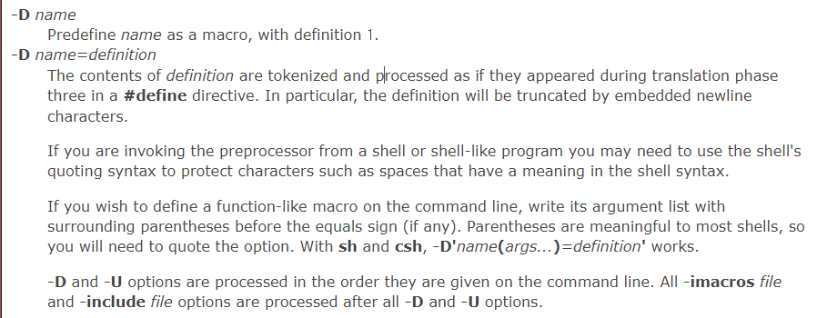
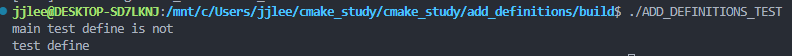

add_definitions 

--- 

- 매크로 변수를 정의하기 위한 cmake 명령어 
- g++ -D 옵션과 동일 (-> g++ -D TEST_DEFINE)
- 유효범위 : 현재 target과 이후 추가된 하위 target에 유효함. 
---
G++ man 

---
- main 
    - lib

위의 cmake 구조에서 lib의 CMakeLists.txt에 add_definitions로 추가했을 때, main에서는 해당 define을 찾지못함. 

--- 

--- 

참고 
- https://linux.die.net/man/1/g++
- https://cmake.org/cmake/help/latest/command/add_definitions.html
