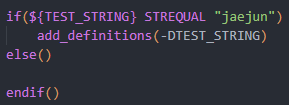
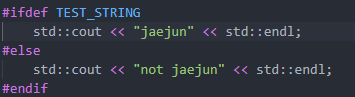

set

- cmake에서 사용하는 변수를 저장 
- cache 변수라는 ( 사용자 입력으로 변수값을 설정할 수 있다 ) 

--- 

ex1.

    - cmake   ->  SET( TEST_BOOL OFF CACHE BOOL "test for cmake")
    - command -> cmake .. -DTEST_BOOL=ON 

ex2.

    - cmake   ->  SET ( TEST_STRING "empty string" CACHE STRING "description")
    - command -> cmake .. -DTEST_STRING="jaejun"

---
결과 

set

---
conditions 

---
command 

--- 
code 

---

참고 

- https://cmake.org/cmake/help/latest/command/set.html
